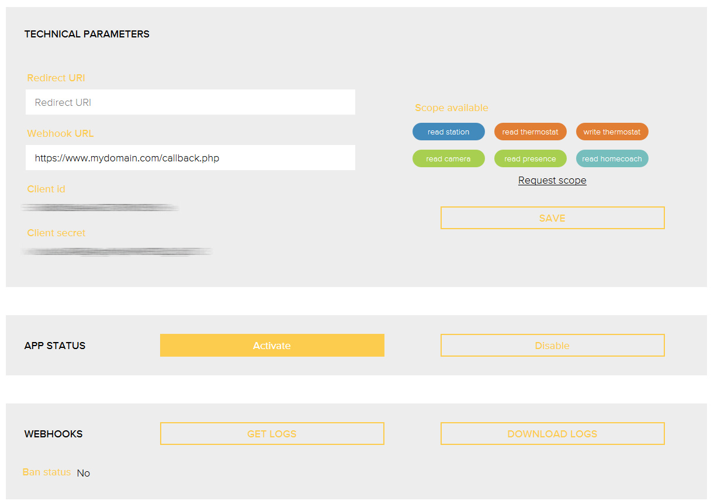

# Netatmo callback

I will try here to explain what is a callback script and why it can be usefull.

You can set such callback script when you create an app on [Netatmo Connect](https://dev.netatmo.com/). Then, each time an event happens (someone is seen outdoor, a known person is seen at home, etc...), Netatmo server will do its job as usual (notifications, make it appear in timeline, etc...) but, it will now send this event to your callback script!

So you won't have to make your script checking timeline or whatever, all events will end to your script automatically. Your script will then be able to do different things regarding the nature of the event. For example, if the home is empty and someone known is seen, you can call Jeedom to say *hello John, welcome home* with a TTS device. Or if your are out and someone is seen outdoor, you can send an email with the snapshot, etc. All is up to you to decide what to do regarding event, time, home state, etc.

## Requirements

- Your Netatmo login and password.
- A Netatmo Connect application.
- A webserver, always accessible from internet.

If you don't have Netatmo App yet, just create one, it's simple and free:

- Register at https://dev.netatmo.com
- Create an app at https://dev.netatmo.com/dev/createanapp (Enter any name)

## How-to

On your Netatmo Connect account, go into your app, at *Technical Parameters*, you will see a field named *Webhook URL*. Here comes the interesting part!

All you will have to do, is enter the url to reach your callback script:
https://www.mydomain.com/callback.php

>But wait until you have read everything before setting it, to not be banned!

<p align="center"></p>

Then on your domain, you will of course have to create your callback.php script.

Now, each time an event get to Netatmo server, this one will be sent back to your script as [json](https://www.w3schools.com/whatis/whatis_json.asp). So, your script will be notified of everything that happens on Netatmo Cameras. You can for example start to log all the data it receive, to get familiar with such data.

You can get the example script [here](callback.php) as a start:

```php
<?php
/*
Webhook called from Netatmo server on Home events

While testing:
error_reporting(E_ALL);
ini_set('display_errors', true);
*/

//__________________________Get the post JSON sent by Netatmo server
$jsonData = file_get_contents('php://input');

//__________________________send ok answer to netatmo immediately to not be banned:
ob_end_clean();
ignore_user_abort(true);
ob_start();
header('Content-Encoding: none');
header("Content-Length: " . ob_get_length());
header("Connection: close");
ob_end_flush();
ob_flush();
flush();

//get data as json:
$data = json_decode($jsonData, true);

//Now you have event data, do what you want with it!
//If message AND known person seen by Welcome:
if(isset($datas['message']) && isset($datas['persons']) && ($eventType == 'person'))
{
    try
        {
            //Can have more than one person:
            if (strpos($datas['message'], 'ont') == true)
            {
                $who = explode(' ont ', $datas['message'])[0];
                $who = explode(' et ', $who);
            }
            else
            {
                $who = array(explode(' a ', $datas['message'])[0]);
            }
            foreach ($who as $person)
            {
                echo 'Hello '.$who.' welcome home!';
            }
        }
    catch (Exception $e)
        {
            logAnswer('Error checking person: '.$e->getMessage());
        }
}

//If message AND person seen by Presence
if(isset($datas['message']) && isset($datas['snapshot_id']) && ($eventType == 'human'))
{
    $snapshotID = $datas['snapshot_id'];
    $snapshotKEY = $datas['snapshot_key'];
    $snapshotURL = 'https://api.netatmo.com/api/getcamerapicture?image_id='.$snapshotID.'&key='.$snapshotKEY;

    echo 'Someone has been seen outdoor, I may arm the gatling.';
}

?>
```

You will notice that first thing I do after receiving the data is to send an "ok" answer to Netatmo server. If you don't send this, the Netatmo server will set your script as unreachable which can end to being banned. So if you have errors later in your script, we have ever answered to Netatmo server. Anyway, if your domain is down for a moment, you can still be banned.

>After 5 failures in the course of one hour, webhooks get banned and Netatmo server will stop sending events for the next 24h. You can unban yourself directly from the webhook section in your app details. You are only allowed to unban yourself 10 times in the course of 24h.

So, you have the way and a small structure to make your own callback script according to your needs.

For example, you can call a Jeedom scenario in some case with just this:

```php
$url = 'https://a123456b.dns1.jeedom.com/core/api/jeeApi.php?apikey=myjeedomapikey&type=scenario&id=00&action=start';
file_get_contents($url);
```
You can add in such url some tags to pass who have been seen, and say Hello with [SNIPS](https://github.com/KiboOst/SNIPS-Tips) or whatever. I won't go into details here, as this depends on your smarthome if any, and what you want to do.

Have a look on Netatmo Connect, on your app at *Webhooks* section. You can have a look at (or download) the log of all events sent to your callback. This will be handy to see which json parts are sent, and how to treat it in your callback script.

Hope this will be helpful ;-)


#### 29/11/2018 | KiboOst
